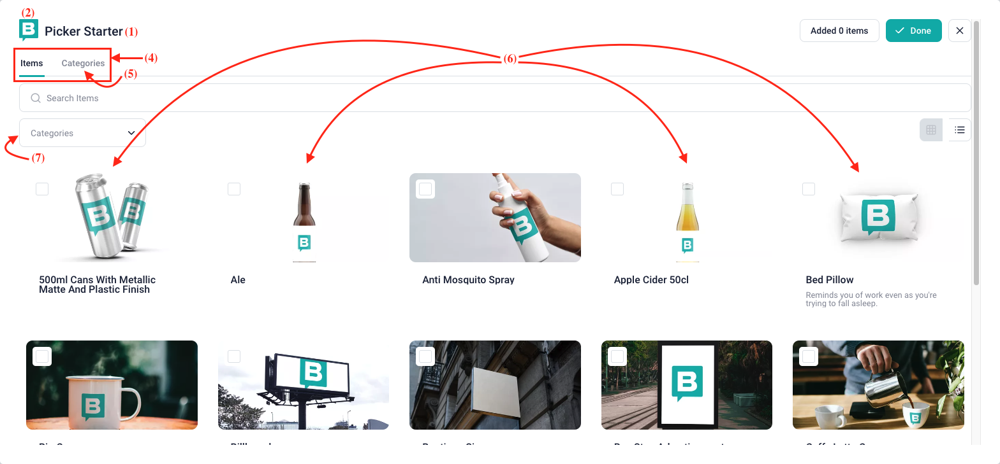
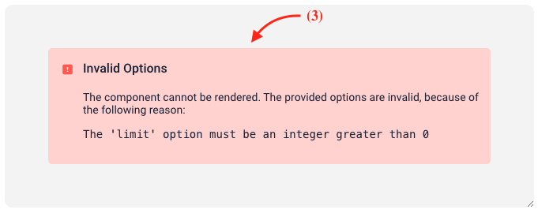
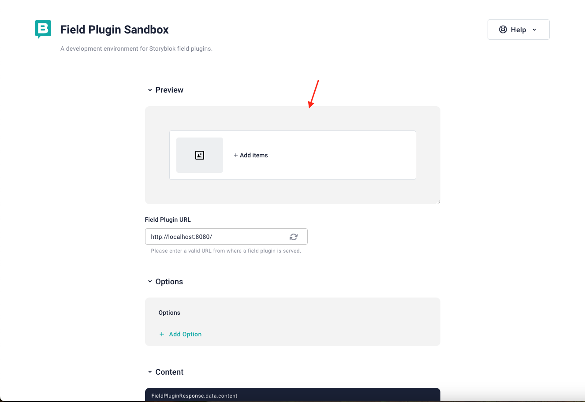

# Picker Starter

| Name           | Description                                             | Author                                                                                                 |
| -------------- | ------------------------------------------------------- | ------------------------------------------------------------------------------------------------------ |
| Picker Starter | A starter project for building e-commerce field plugins | [Demetrius Feijóo](https://github.com/demetriusfeijoo) & [Alba Silvente](https://github.com/Dawntraoz) |

A starter project for building e-commerce [field plugins](https://www.storyblok.com/docs/plugins/field-plugins/introduction) and other “picker” field plugins – for example, integrations with digital asset management (DAM) systems.


The primary goal of this starter is to provide developers with a clear blueprint for creating their own `pickers` just by making small changes to it.

## `picker.config.ts`

The [`picker.config.ts`](./src/picker.config.ts) is a configuration file where you can customize the title, icon, tabs, filters, methods to perform queries, and also a method to validate the expected [plugin options](https://www.storyblok.com/docs/plugins/field-plugins/introduction#options).

In the example below you can have a glimpse of what this file looks like and its responsibilities:

```ts
export default defineConfig((options) => {
  const config: PickerConfig = {
    title: 'Picker Starter', //(1) modal's title
    icon: StoryblokIcon, //(2) modal's icon
  }

  const { setErrorNotification } = useErrorNotification()

  try {
    //(3) optional function responsible for validating the plugin's options and showing a warning in case of failure.
    config.validateOptions = () => {
      const { limit } = options

      const isLimitOptionValid = limit === undefined || Number(limit) > 0

      if (!isLimitOptionValid) {
        //(3) In case of failure, the returned object needs to look like this
        return {
          isValid: false,
          error: `The 'limit' option must be an integer greater than 0`,
        }
      }

      // If all the options are valid (in case it relies on options)
      // the returned object will look like this
      return {
        isValid: true,
      }
    }

    //(4) All of your Picker's tabs. You can have as many as your picker needs.
    config.tabs = [
      {
        name: 'items', //mandatory field used to identify this tab
        label: 'Items', //(5) displayed in the modal
        query: queryItems, //(6) it fetches, sorts, and filter all the data for this tab
        getFilters: getItemFilters, //(7) select input acting like filters to the data
        onError: errorHandler, // An optional hook that is triggered whenever an error occurs during data fetching or filter creation
      },
    ]
  } catch (err) {
    // whenever a generic error occurs and we want to display it on the main page
    setErrorNotification({
      location: 'main',
      title: 'Plugin could not be initialized',
    })
  }

  // it must always return a config, no matter if an error has occurred or not.
  return config
})
```




### Error Handling

Handling errors in your application can be approached in many different ways, and this starter doesn't enforce a specific method. However, it does provide tools to help you catch and display errors more easily.

Errors can be caught either globally or by listening for errors that occur in your service (tab) during `query` or `getFilters` calls.

#### Handle errors globally

Sometimes, you may want your application to catch all kinds of errors, regardless of their origin or type.

In such cases, you can achieve this by wrapping the entire `defineConfig` implementation in a try/catch block.

This allows you to handle unexpected errors—whether by displaying a message to the user or logging the issue to a service like Sentry.

**Example:**

```ts
export default defineConfig(() => {
  const config: PickerConfig = {...}

  try {
    config.tabs = [...]
  } catch (err) {
    // Display the error to the user
    // Console log the error
    // Send the error to Sentry
  }

  return config
})
```

> [!NOTE]
> The `defineConfig` function must always return a valid config object—even if an error occurs.  
> Failing to do so will prevent the plugin from rendering correctly.

#### Services (Tabs) errors

If your application needs to handle errors from a specific service (tab) that occur during `query` or `getFilters` calls, you can do so by implementing the `onError` hook for that service.

**Example:**

```ts
export default defineConfig(() => {
  const config: PickerConfig = {...}

  try {
    config.tabs = [
      {
        name: '...',
        label: '...',
        query: () => {...},
        getFilters: () => {...},
        onError: (tabItemError: TabItemError) => {
          // Here your plugin can check (tabItemError.type) if the error was thrown during `query` or `getFilters` call
          // It can also display the error to the user, for example.

          // When false, it will prevent the error from being displayed to the user using the default behavior.
          return false
        }
      },
    ]
  } catch (err) {
    // ...
  }

  return config
})
```

#### Displaying errors

Your plugin can display errors on both `modal` and `main` (non-modal view) level by just using the `useErrorNotification` composable and its `setErrorNotification` method.

If you want to capture any kind of error globally and display it to the user, for example, you could do something like the following:

```ts
export default defineConfig(() => {
  const config: PickerConfig = {...}

  try {
    // some error is thrown here
  } catch (err) {
    // errors are captured here and displayed to the user using the composable.
    const { setErrorNotification } = useErrorNotification()

    setErrorNotification({
      location: 'main', // `modal` or `main` (non-modal) are valid values.
      title: 'Ops! Something bad happened!',
    })
  }

  return config
})
```

## Local Development

To start using this starter locally in your project, just run:

```sh
# copy this starter into your cwd
npx giget@latest gh:storyblok/field-type-examples/picker-starter YOUR-PROJECT-NAME

# open it
cd YOUR-PROJECT-NAME

# install all required dependencies
yarn install

# then, serve the field plugin
yarn dev

# more commands for linting, testing and building
yarn prettier
yarn lint
yarn test
yarn test:types
yarn build
yarn preview
```

Now open the Sandbox URL printed in your terminal:


You should see this:



## Deploy

Deploy your field plugin with the [CLI](https://www.npmjs.com/package/@storyblok/field-plugin-cli). Issue a [personal access token](https://app.storyblok.com/#/me/account?tab=token), rename `.env.local.example` to `.env.example`, open the file, set the value `STORYBLOK_PERSONAL_ACCESS_TOKEN`, and from the **plugin's root folder**, run the following command:

```shell
yarn deploy # (Official plugins) --skipPrompts --name sb-picker-starter --scope partner-portal
```
